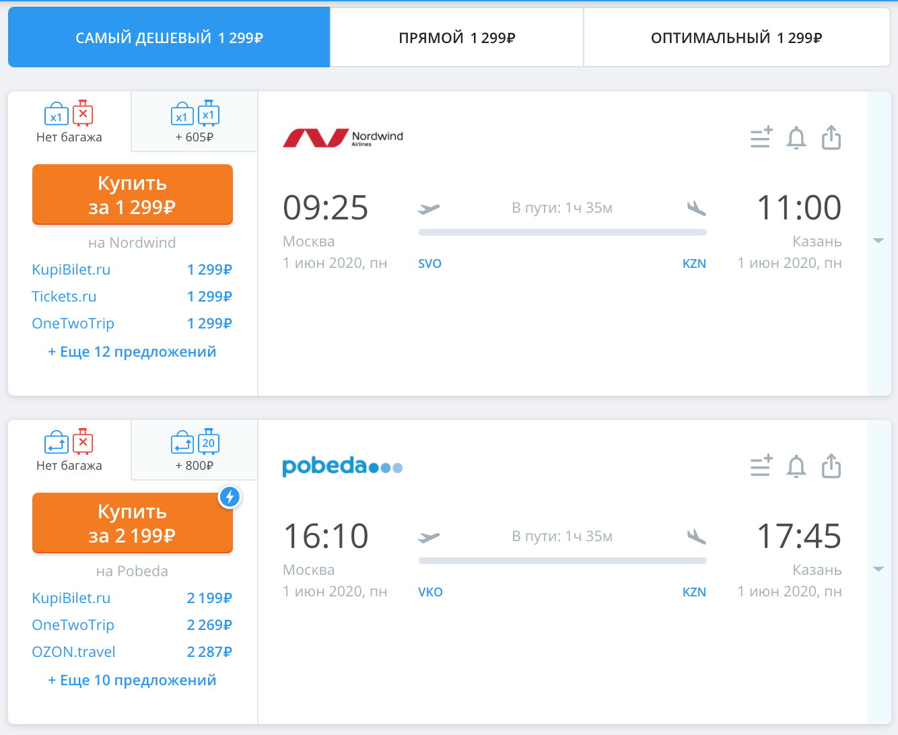

## Задание 1. Поиск билетов (обязательное к выполнению) 

Вы работаете в сервисе по продаже авиабилетов онлайн.

Что вам нужно сделать:

1. Спроектируйте класс для информации о билете.
2. Реализуйте репозиторий для хранения информации о билетах: добавить, удалить, получить набор билетов.
3. Реализуйте менеджера поиска по аэропорту вылета и аэропорту прилёта, даты не учитывайте.

**Информация о билете**

Класс информации о билете — это data-класс, который должен содержать:

1. ID.
2. Стоимость, для упрощения будем считать стоимость единой для всех продавцов.
3. Аэропорт вылета, вы можете использовать [IATA-коды](https://ru.wikipedia.org/wiki/%D0%9A%D0%BE%D0%B4_%D0%B0%D1%8D%D1%80%D0%BE%D0%BF%D0%BE%D1%80%D1%82%D0%B0_%D0%98%D0%90%D0%A2%D0%90).
4. Аэропорт прилёта, вы можете использовать [IATA-коды](https://ru.wikipedia.org/wiki/%D0%9A%D0%BE%D0%B4_%D0%B0%D1%8D%D1%80%D0%BE%D0%BF%D0%BE%D1%80%D1%82%D0%B0_%D0%98%D0%90%D0%A2%D0%90).
5. Время в пути в минутах.

Других данных не нужно.

Этот класс должен реализовывать интерфейс <code>Comparable<...></code> так, чтобы по умолчанию сортировка происходила по цене, самый дешёвый — самый первый. Для этого шапка вашего дата-класса должна выглядеть как-то так:

<code>public class Ticket implements Comparable < Ticket > {</code>

После чего идея подсветит вам её красным, нажмите на подсказку и выберите «Implement methods» — «Реализовать методы». Идея сама сгенерирует заглушку для нужного метода из этого интерфейса, которая всегда возвращает <code>0</code>. Вам надо переписать тело сгенерированного метода, чтобы если билет, у которого вызвали метод <code>compareTo</code>, стоит дешевле, чем тот, который передали через параметр, то возвращалось бы число меньше нуля. Если же билет, наоборот, дороже, то число больше нуля, а если стоимость одинакова, то <code>0</code>. Дав верную реализацию этому методу, вы научите Java сравнивать объекты этого класса.

**Репозиторий**

Репозиторий для хранения билетов ничем не отличается от тех репозиториев, что мы проходили раньше.

### Менеджер

В менеджере методов <code>findAll</code> должен претерпеть некоторые изменения — он должен принимать два параметра:

* from — аэропорта вылета,
* to — аэропорт прилёта.

Значит, в результате поиска возвращается массив только с теми билетами, что соответствуют условиям поиска. Методы поиска вы уже делать умеете.

Кроме того, результаты должны быть отсортированы по цене от меньшей к большей.

### Автотесты

Напишите автотесты на поиск, удостоверившись, что он удовлетворяет условиям задачи. Количество тестов и тестируемые сценарии мы оставляем на ваше усмотрение.

Итого: у вас должен быть репозиторий на GitHub, в котором расположен ваш Java-код и автотесты к нему, GitHub Actions и т. д. — всё как обычно.

Отправьте на проверку ссылку на репозиторий GitHub с вашим проектом.